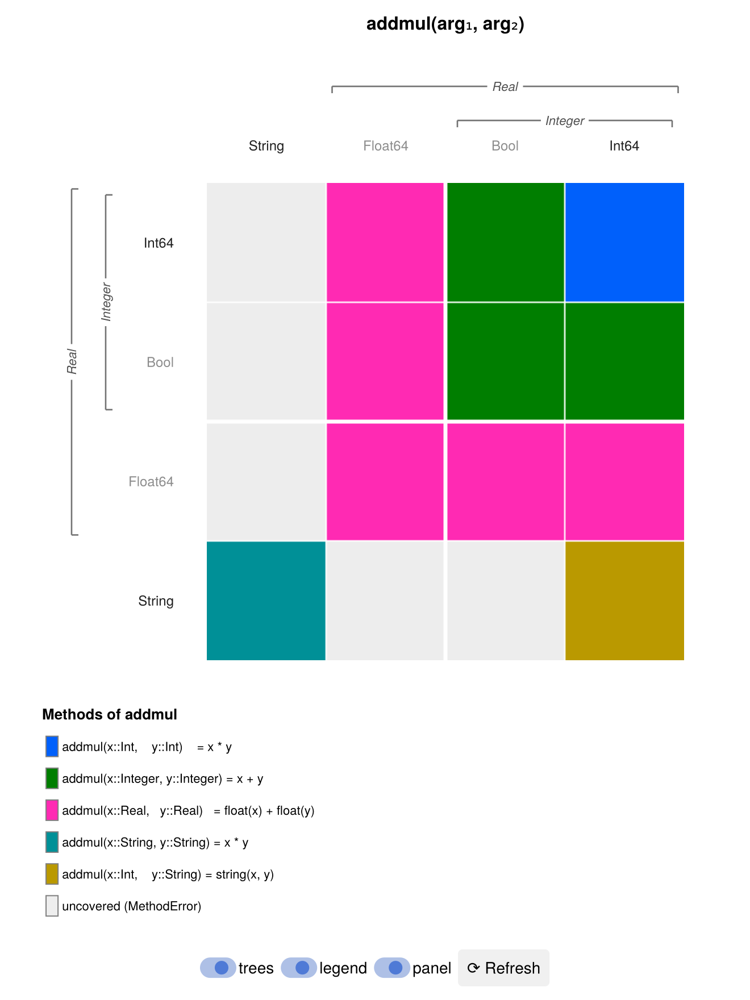

# DispatchDisplay.jl

Visualise Julia's **multiple dispatch** as a reactive **1D / 2D / 3D grid** with
[Makie](https://docs.makie.org). Register a function and you get a grid over a
space of candidate argument types, where **each cell is coloured by the method
Julia would actually dispatch to** for those concrete types.

It's a teaching tool: it makes the shape of a generic function visible — which
type combinations are covered, where a concrete method specialises an abstract
one, and where the type space has holes.



## What the grid shows

For each cell (a concrete combination of argument types) the package runs the
same query Julia's compiler does and colours the cell by the result:

| Appearance | Meaning |
|---|---|
| a method's colour | that single method owns the cell (`which(f, …)`) |
| grey | **uncovered** — calling `f` here is a `MethodError` |
| amber | **partial** — an *abstract* cell where some concrete subtypes dispatch and others don't |
| red | **ambiguous** — several equally-specific methods, none most specific |

This directly answers the four things you usually want to see:

1. **Coverage of the type space** — provide the candidate types up front and the
   grey cells are exactly the gaps.
2. **Coverage of specific methods** — a method with concrete arguments is a
   single cell/voxel; an abstract method spreads across every subtype it covers.
3. **Colour-coded methods** — the legend below the grid lists every method next
   to its colour. Method colours are **stable**: defining new methods never
   reshuffles the colours of existing ones.
4. **Subtyping** — only the candidate types appear on the axes (tree-ordered so
   subtypes sit together); every abstract type used in a method signature is
   drawn as a **bracket** spanning the axis types it covers, nested by
   containment (e.g. `Integer` inside `Real`). A concrete method then shows up
   as a specialised cell *inside* the broader region of its abstract sibling.

### Hover & legend

Hovering a cell (1D/2D/3D) **highlights the owning method in the legend**.

The legend is adaptive: when every method's source is short it's shown
**inline** in the legend (via [CodeTracking](https://github.com/timholy/CodeTracking.jl)),
so there's nothing extra to read. Only when a method is long or multi-line does
a separate **hover panel** appear between the grid and the legend, showing the
full source of whatever cell you're pointing at (and explaining
uncovered/partial/ambiguous cells).

The figure is laid out vertically (grid → [hover panel] → legend → refresh
button) so it reads well in a split-screen next to your editor. The 1D strip
uses a shorter window automatically.

## Install

```julia
import Pkg
Pkg.develop(path="path/to/DispatchDisplay")
Pkg.add("GLMakie")     # or CairoMakie / WGLMakie — the package is backend-agnostic
```

## Usage

Load a Makie backend, then register a function:

```julia
using GLMakie            # interactive window (best for 3D + the refresh button)
using DispatchDisplay

combine(x::Int,    y::Int)    = x + y
combine(x::Number, y::Number) = float(x) + float(y)
combine(x::String, y::String) = x * y
combine(x::Int,    y::String) = string(x, y)

# Provide the candidate types per argument (one vector per argument):
d = dispatchdisplay(combine,
        [Int, Float64, Bool, String],
        [Int, Float64, Bool, String])
```

* **1D** strip — pass one vector: `dispatchdisplay(f, [Int, Float64, String])`
* **2D** heatmap — pass two vectors (above)
* **3D** voxel cubes — pass three vectors

With **no types**, the concrete types are inferred from `f`'s signatures and the
dimensionality from its most common arity (pass `arity` to force it):

```julia
dispatchdisplay(combine)        # axes inferred from the signatures
```

### Whole-operator mode

You can point it at an entire operator and let it take the *arity* instead of a
type set. Axes always hold **concrete** types only; abstract methods
(`+(::Integer, ::Integer)`, …) show up as colours and as subtype brackets.

```julia
dispatchdisplay(+, numeric_types(), numeric_types())  # tidy curated numeric grid
dispatchdisplay(+; arity = 2)                          # every concrete type from + 's signatures
```

`numeric_types()` is a built-in palette of common concrete number types. The
full `arity` grid can be large (hundreds of types), so it renders as a
**zoomable dispatch map**: a colored "fingerprint" with no labels, where
**scroll-zoom reveals the type labels** for the cells in view (level-of-detail)
and hovering identifies the method. Past ~16 methods the legend is dropped in
favour of hover, since a legend that big is unreadable.

## Reactivity

The grid is backed by `Observable`s and is **re-queryable**. After defining new
methods, click the **⟳ Refresh** button in the figure, or call:

```julia
combine(x::Bool, y::Bool) = xor(x, y)
refresh!(d)
```

`refresh!` re-reads `f`'s methods and **expands the type space**: any new types
found in freshly-defined method signatures are added to the axes (unioned with
the types you provided), so the grid grows to include them.

## How it works

* `methods(f)` gives the signatures; the argument count picks the dimensionality.
* For each cell with concrete types `(T₁, …, Tₙ)`, the owner is decided by type
  reasoning equivalent to a real call: a method *covers* the cell when
  `Tuple{typeof(f), T₁, …} <: m.sig`, and `which(f, (T₁, …))` picks the most
  specific — with `typeintersect` distinguishing *uncovered* / *partial* /
  *ambiguous*.
* Axes are ordered by each type's supertype chain so subtypes are contiguous,
  and contiguous runs sharing a top-level abstract supertype get a bracket.

Supports functions whose methods take **1–3 arguments**. Varargs methods are
skipped when inferring the grid.

## Development

```julia
julia --project=. -e 'using Pkg; Pkg.test()'   # runs logic + headless renders
```

The test suite renders 1D/2D/3D figures with CairoMakie to `test/out_*.png`.

Examples in `examples/`:

* `simple.jl` — the minimal 1D case.
* `demo.jl` — an interactive 2D walkthrough.
* `inheritance.jl` — a three-level type hierarchy (`Animal → Mammal/Bird → …`)
  with `meets` overloaded at every level, showing nested subtype brackets.
* `operator_grid.jl` — the whole-operator / arity mode: `+` over `numeric_types()`
  and the zoomable full `dispatchdisplay(+; arity=2)` dispatch map.
* `rock_paper_scissors.jl` — Mosè Giordano's
  [rock-paper-scissors](https://giordano.github.io/blog/2017-11-03-rock-paper-scissors/)
  as multiple dispatch (3-way and the 4-way "Well" variant). Each win-rule is a
  cell, the diagonal is the `Tie` method, and the mirror triangle is the
  `play(a, b) = play(b, a)` commutativity fallback.
* `gen_assets.jl` — regenerates the images in this README.
